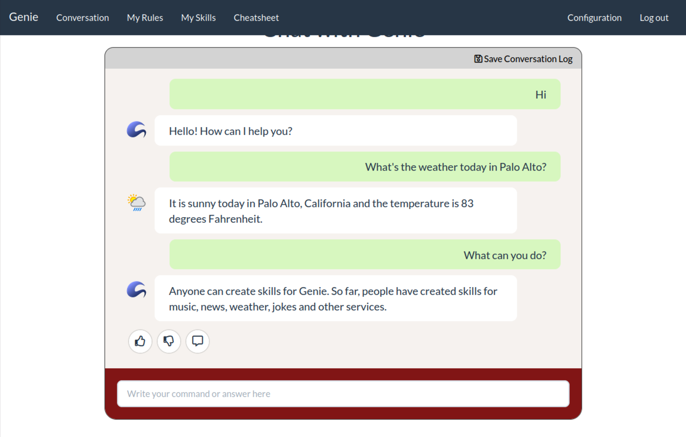

# Improve your Wikidata skill

In part 1, we have automatically built a question-answering skill for a Wikidata domain with no manual input. As you might have found out, it does not perform well in real world. 
However, it provides a good baseline for the developer to collect data and improve upon. 
In this homework, we will add a little manual effort in the form of property annotation to improve the quality of your Wikidata skill. 

## Setup

We will continue running all the experiments under directory `hw2`. Run the following on your GCP instance to get the latest update of this repo:
```bash
cd cs224v-fall2022
git stash # following the prompt to configure git if needed
git pull
git stash pop
```

## Edit the annotations in the manifest

The skill manifest is located at `<YOUR_DOMAIN>/manifest.tt`. It contains the schema of the domain, including entities involved, the properties available, and automatically generated natural language annotations from part 1. 

The automatically generated annotations are apparently not perfect, especially because the name of each property in Wikidata is often clunky and unnatural. Now we are going to manually update them. 

A reference guide for the syntax can be found [here](https://wiki.genie.stanford.edu/en/attic/genie/annotations). Only "Function Canonical Form" and "Parameter Canonical Form" sections are needed for the homework. 

Add **as many annotations as you can** in different parts of speech and correct the bad annotations generated by Genie. 
Note that for noun phrases, both singular and plural forms are ok. 

We **highly recommend** download the manifest locally via `scp` and upload it when it's ready. You can use your favorite editor locally and in the meanwhile, you can stop the VM instance to save cost. 
```bash
# download 
gcloud compute scp "<YOUR_VM_NAME>":~/cs224v-fall2022/hw2/<"YOUR_DOMAIN">/manifest.tt ./
# upload
gcloud compute scp ./manifest.tt "<YOUR_VM_NAME>":~/cs224v-fall2022/hw2/<"YOUR_DOMAIN">/
```

## Test canonical forms

An utterance-ThingTalk program pair sampler tool is available to help you evaluate your canonical forms. This tool is capable of generating samples of single-turn commands and ThingTalk programs with projection and filter properties. Single-turn commands are the natural language commands that your virtual assistant will attempt to generate based on the canonical forms you defined in the manifest file. ThingTalk programs can help give you a sense of what query operations will be executed relative to the generated natural language command.

The resulting code pairs are saved to a tsv file where each row contains the `id`, `command utterance`, and `ThingTalk program` for each example.

Run the following to test your updated manifest file:
```bash
touch ~/cs224v-fall2022/hw2/<"YOUR_DOMAIN">/constants.tsv
genie sample-synthetic-data --output ~/cs224v-fall2022/hw2/<"YOUR_DOMAIN">/samples.tsv --thingpedia ~/cs224v-fall2022/hw2/<"YOUR_DOMAIN">/manifest.tt --constants ~/cs224v-fall2022/hw2/<"YOUR_DOMAIN">/constants.tsv --device $YOUR_DOMAIN
```
Parameters:
```bash
--output        Output file location (in tsv file)
--thingpedia    Path to your domain manifest.tt file
--constants     Path to your domain constants (sample values) TSV file
--device        Your domain name
```

For more testing, you can read the details in the [Test Natural Language Support
](https://wiki.genie.stanford.edu/en/genie-guide/test-natural-language-support) reference guide.

## Re-run synthesis and training 
Once the manifest is uploaded, we can re-run the synthesis and training:
```bash
# clean existing data 
make clean-synthesis

# rerun synthesis and training
make train model=2
```

Note that `make train` will automatically rerun `make synthesis`. 
By default the model name is set to `1`. **Do not** run `make train` without overriding the model name, otherwise it will overwrite the model trained in part 1. 

## Evaluate 
Similar to part 1. Run the following command with model `2` to evaluate the new model.
```bash
make evaluate
```

After the evaluation finishes, you will now have `./<DOMAIN>/eval/2.results` and `./<DOMAIN>/eval/2.debug`.
How is your accuracy? Is it better than model 1? 

## Compare model 1 and 2 
Follow the same instruction in part 1 to start the almond server (set `--nlu_model 2` when starting the nlu server). Try the same commands you tested in part 1. Does the model perform better now? 

Pick five examples from the eval set that are parsed correctly in both part 1 and 2, i.e., the ones in `eval/annotated.tsv` but not in `eval/1.debug` and `eval/2.debug`.
Try to paraphrase them, and test them on both model 1 and model 2. How do they perform? Which one is more robust?  

For details of the format of `.debug` files, check [instructions/eval-metrics.md](./eval-metrics.md).

## Add more training & evaluation data

You can add more annotated data to your training and evaluation datasets by:
1. Clicking the `Save Conversation Log` button on the top right-hand corner to download the log file
    <center></center>
2. Copy and paste the lines starting with `U:` (natural language utterance) and `UT:` (Thingtalk code) to your training and evaluation datasets (`annotation.txt`), which should be located at `~/cs224v-fall2022/hw2/<"YOUR_DOMAIN">/eval/train/annotated.txt` and `~/cs224v-fall2022/hw2/<"YOUR_DOMAIN">/eval/dev/annotated.txt`, respectively. For example:
    ```bash
    ====
    # unique tag
    U: What's the weather today in Palo Alto?
    UT: $dialogue @org.thingpedia.dialogue.transaction.execute;
    UT: @org.thingpedia.weather.current(location=new Location("palo alto"));
    ```
3. Edit the Thingtalk code if there is a mistake

## Submission
Each student should submit a pdf or text file with answers for the following questions, plus the `manifest.tt` file with your manual annotations.
- The domain you chose
- The accuracy of your new model, and how it compares with the model in part 1. 
- The accuracy of the 5 commands you tested in part 1. Is the new model better? 
- The five commands you picked from the eval set and your paraphrases for them. 
- The accuracy of the 5 paraphrases for both model 1 and model 2 and how they were compared.
- What conclusion can you draw from the comparison?
- (Open-ended) What are the alternative ways you can think of to generate these annotations automatically? And in general, based on your experience in the homework, can you propose other ways to improve/augment Genie? Both neural and non-neural solutions are welcome.