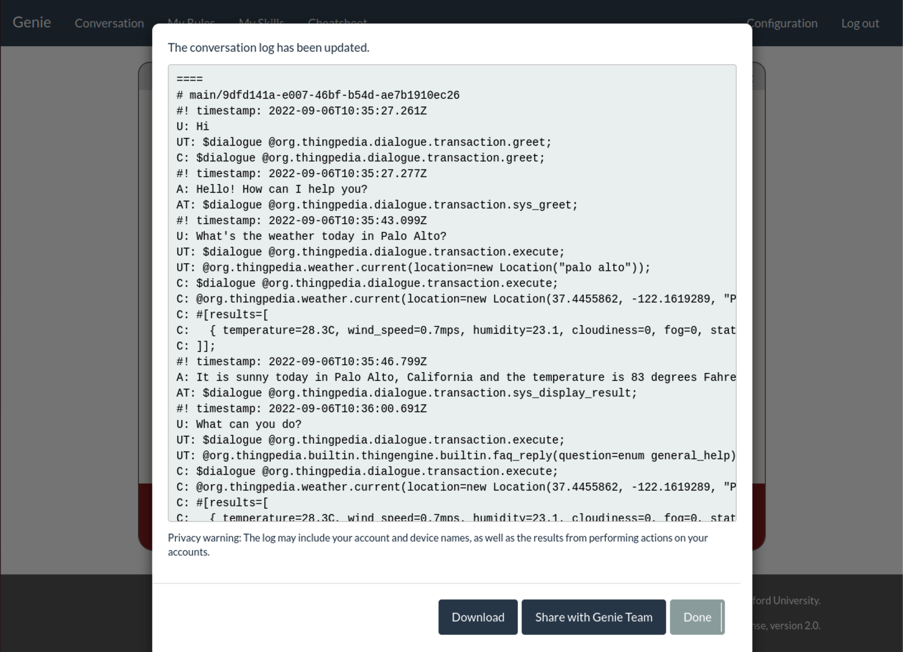
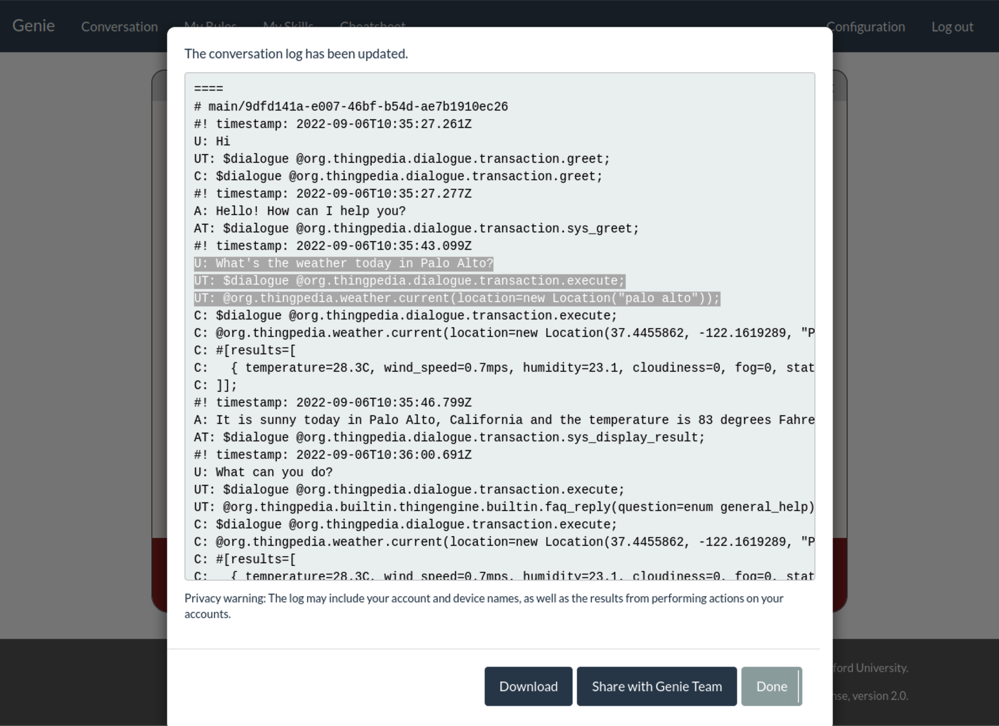

# Improve your Wikidata skill

In part 1, we have automatically built a question-answering skill for a Wikidata domain with no manual input. As you might have found out, it does not perform well in real world. 
However, it provides a good baseline for the developer to collect data and improve upon. 
In this homework, we will add a little manual effort in the form of property annotation to improve the quality of your Wikidata skill. 

## Table of contents

- [Setup](#setup)
- [Edit the annotations in the manifest](#edit-the-annotations-in-the-manifest)
- [Test canonical forms](#test-canonical-forms)
- [Re-run synthesis and training](#re-run-synthesis-and-training)
- [Evaluate](#evaluate)
- [Compare model 1 and 2](#compare-model-1-and-2)
- [Add more training & evaluation data](#add-more-training--evaluation-data)
- [Submission](#submission)

## Edit the annotations in the manifest

The automatically generated annotations are apparently not perfect, especially because the name of each property in Wikidata is often clunky and unnatural. Now we are going to manually update them. 


The synthesizer tries to create different sentences that refer to the properties in different parts of speech. Note that typically each property can be referred to naturally in only a few parts of speech. 

You can improve the synthesizer by adding annotations in different parts of speech and correct the bad annotations generated by Genie. Note that for noun phrases, both singular and plural forms are ok. 

We **highly recommend** download the manifest locally via `scp` and upload it when it's ready. You can use your favorite editor locally and in the meanwhile, you can stop the VM instance to save cost. 
```bash
# download 
gcloud compute scp "<YOUR_VM_NAME>":~/cs224v-fall2022/hw2/<"YOUR_DOMAIN">/manifest.tt ./
# upload
gcloud compute scp ./manifest.tt "<YOUR_VM_NAME>":~/cs224v-fall2022/hw2/<"YOUR_DOMAIN">/
```

A reference guide for the annotation syntax can be found [here](https://wiki.genie.stanford.edu/en/attic/genie/annotations). Only "Function Canonical Form" and "Parameter Canonical Form" sections are needed for the homework. 

To ensure that your annotations are written properly, you can see how your annotations are used in synthesis by running the following on your updated manifest file:
```bash
touch ~/cs224v-fall2022/hw2/<"YOUR_DOMAIN">/constants.tsv
genie sample-synthetic-data --output ~/cs224v-fall2022/hw2/<"YOUR_DOMAIN">/samples.tsv --thingpedia ~/cs224v-fall2022/hw2/<"YOUR_DOMAIN">/manifest.tt --constants ~/cs224v-fall2022/hw2/<"YOUR_DOMAIN">/constants.tsv --device org.wikidata
```
Parameters:
```bash
--output        Output file location (in tsv file)
--thingpedia    Path to your domain manifest.tt file
--constants     Path to your domain constants (sample values) TSV file
--device        Your domain name
```

This command will only synthesize a small sample of training data (consisting of simple sentences that just use a filter or a projection). Each row of the file (.tsv) is a training sample consisting of the `id`, `command utterance`, and `ThingTalk program`. Just perusing this output will be sufficient for you to debug your annotations. 

For more details, you can read the [Test Natural Language Support
](https://wiki.genie.stanford.edu/en/genie-guide/test-natural-language-support) reference guide.

## Re-run synthesis and training 
Once the manifest is uploaded, we can re-run the synthesis and training:
```bash
# clean existing data 
make clean-synthesis

# rerun synthesis and training
make train model=2
```

Note that `make train` will automatically re-run `make synthesis`. 
By default the model name is set to `1`. **Do not** run `make train` without overriding the model name, otherwise it will overwrite the model trained in part 1. 

## Evaluate 
Similar to part 1. Run the following command with model `2` to evaluate the new model.
```bash
make evaluate
```

After the evaluation finishes, you will now have `./<DOMAIN>/eval/2.results` and `./<DOMAIN>/eval/2.debug`.
Now, how is your accuracy? Is it better than model 1? 

## Compare model 1 and 2 
Follow the same instruction in part 1 to start the Genie server (set `--nlu_model 2` when starting the nlu server). Try the same commands you tested in part 1. Does the model perform better now? 

Pick five examples from the eval set that are parsed correctly in both part 1 and 2, i.e., the ones in `eval/annotated.tsv` but not in `eval/1.debug` and `eval/2.debug`.
Try to paraphrase them, and test them on both model 1 and model 2. How do they perform? Which one is more robust?  

For details of the format of `.debug` files, check [instructions/eval-metrics.md](./eval-metrics.md).

## Add more training & evaluation data

You can add more annotated data to your training and evaluation datasets by:
1. Clicking the `Save Conversation Log` button on the top right-hand corner
    <center></center>
2. Inspecting or downloading the log file to the local directory
    <center></center>
3. Editing the Thingtalk code if there is a mistake and saving the file
4. Copying the lines starting with `U:` (natural language utterance) and `UT:` (Thingtalk code) 
    <center></center>
5. Pasting and formatting the code to follow the same format as in your training set (`datadir/train.tsv`) and/or dev set (`datadir/valid.tsv`). It should be one example per line where items in each example are delimited by a tab.

    ```text
    #ID {Natrual language command (values from U:)}   {Thingtalk code (values from UT:)}
    #ID {Natrual language command (values from U:)}   {Thingtalk code (values from UT:)}
    ...
    ```

    For example:
    ```text
    manual/001	what's the weather today in Palo Alto?	$dialogue @org.thingpedia.dialogue.transaction.execute; @org.thingpedia.weather.current(location=new Location("palo alto"));
    manual/002	what's the weather today in San Jose?	$dialogue @org.thingpedia.dialogue.transaction.execute; @org.thingpedia.weather.current(location=new Location("san jose"));
    ```
6. Run the following command to train the model on the new augmented `train.tsv`
    ```bash
    make train_augmented model=3
    ```

## Submission
Each student should submit a pdf or text file with answers for the following questions, plus the `manifest.tt` file with your manual annotations.
- The domain you chose
- The accuracy of your new model, and how it compares with the model in part 1. 
- The accuracy of the 5 commands you tested in part 1. Is the new model better? 
- The five commands you picked from the eval set and your paraphrases for them. 
- The accuracy of the 5 paraphrases for both model 1 and model 2 and how they were compared.
- What conclusion can you draw from the comparison?
- (Open-ended) What are the alternative ways you can think of to generate these annotations automatically? And in general, based on your experience in the homework, can you propose other ways to improve/augment Genie? Both neural and non-neural solutions are welcome.
